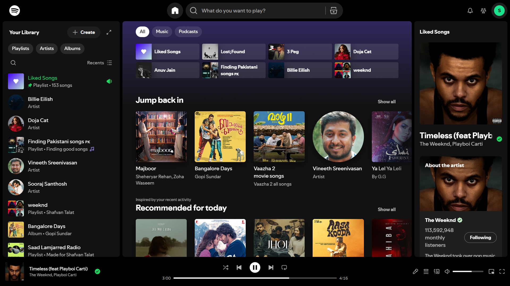

# Spotify Mod — Chrome Extension

> A lightweight Chrome extension that removes ads and hides the upgrade prompt on the Spotify Web Player.

---

## Features

- Blocks audio ads from playing
- Blocks Google display/banner ads
- Hides the "Upgrade to Premium" button
- Built with Manifest V3 (works on modern Chrome)

---

## How to Install

1. Clone or download this repository into a folder
2. Go to `chrome://extensions` in Chrome
3. Enable **Developer mode** (toggle in the top-right corner)
4. Drag & drop the `Spotify-Mod-Chrome-Plugin` folder onto the page
5. Open [Spotify Web Player](https://open.spotify.com)

---

## ⚠️ Disclaimer

> **This project is intended strictly for educational and testing purposes only.**
>
> - This extension is **not for sale** and must not be distributed commercially
> - It is **not affiliated with, endorsed by, or connected to Spotify AB** in any way
> - Use of this extension may violate [Spotify's Terms of Service](https://www.spotify.com/legal/end-user-agreement/) — use at your own risk
> - The author takes **no responsibility** for any account suspension or legal consequences arising from its use
> - This project exists solely to demonstrate how Chrome Extensions and network request blocking work

**By using this extension, you acknowledge that it is for personal, educational use only.**

---

## License

For educational use only. Not for redistribution or commercial use.
